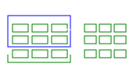

# Kivy RecycleView 使用の手引き

大量のデータセットを効率的に扱う。
ビュー（データセット表示用のウィジット）をレイアウト（``ScrollView``を継承）に詰め込み、ビューを再利用する。
MVCに基づくクラス構成をしている。

||MVC|抽象クラス|具象クラス|説明|
|---|---|---|---|---|
|M|Model|RecycleDataModeBehavior|RecycleDataModel|dict型のリストで渡されたデータモデル。|
|V|View|RecycleLayoutManagerBehavior|RecycleLayout|レイアウトとビューで構成。アダプターを介して実装。|
|C|Controller|RecycleViewBehavior|RecycleView|相互作用を決定し、``RecycleViewBehavior``によって実装。|

## 使用方法

``RecycleView``のインスタンス化時、ビュー（``viewclass`` or ``key_viewclass``）とデータクラスを自動生成する。
レイアウト（``RecycleLayout``, ``RecycleBoxLayout``, ``RecycleGridLayout``, ...）をユーザーが作成し、``RecycleView``に追加する。
追加されたレイアウトは、自動的に **layout_manager** となる。削除される場合も同様。
``data`` に、データ（dict型に加工済み）リストを割り当てる。

## データの変更がビューに反映されるまでの流れ

~~~mermaid
flowchart LR
  a["データの変更"]
  b["RecycleDataModelBehavior.on_data_changed"]
  c["recycleview.refresh_from_data"]
  d["recycleview.refresh_views"]

  a-- ディスパッチ -->b-- バインド -->c-- コール -->d
~~~

## recycleview のクラス図

~~~mermaid
---
title: recycleview
config:
  class:
    hideEmptyMembersBox: true
---
classDiagram
  direction RL

  namespace 実装の例 {
    class データ
    class コントローラー
    class レイアウト
    class ビュー
  }

  namespace kivy.uix.recycleview {
    class RecycleViewBehavior {
        refresh_from_data(*largs, **kwargs)
        refresh_from_layout(*largs, **kwargs)
        refresh_from_viewport(*largs)
    }
    class RecycleView {
        data_model
        view_adapter
        layout_manager
    }
  }

  namespace kivy.uix.recyclelayout {
    class RecycleLayout
  }

  namespace kivy.uix.recycleview.layout {
    class LayoutSelectionBehavior {
        apply_selection(index, view, is_selected)
        refresh_view_layout(index, layout, view, viewport)
    }
    class RecycleLayoutManagerBehavior {
        viewclass
        key_viewclass
        recycleview
        refresh_view_layout(index, layout, view, viewport)
        get_view_index_at(pos)
        goto_view(index)
    }
  }

  namespace kivy.uix.recycleboxlayout {
    class RecycleBoxLayout
  }

  namespace kivy.uix.recyclegridlayout {
    class RecycleGridLayout
  }

  namespace kivy.uix.recycleview.datamodel {
    class RecycleDataModelBehavior {
        recycleview
        on_data_changed(*largs, **kwargs)
    }
    class RecycleDataModel {
        data
    }
  }

  namespace kivy.uix.recycleview.veiws {
    class RecycleDataAdapter {
        recycleview
        views
        refresh_view_attrs(index, data_item, view)
        refresh_view_layout(index, layout, view, viewport)
    }
    class RecycleDataViewBehavior {
        refresh_view_attrs(rv, index, data)
        refresh_view_layout(rv, index, layout, viewport)
        apply_selection(rv, index, is_selected)
    }
    class RecycleKVIDsDataViewBehavior {
        refresh_view_attrs(rv, index, data)
    }
  }

  class CompoundSelectionBehavior

  ScrollView <|-- RecycleView
  RecycleViewBehavior <|-- RecycleView

  RecycleDataViewBehavior <|-- RecycleKVIDsDataViewBehavior
  EventDispatcher <|-- RecycleDataAdapter

  RecycleDataModelBehavior <|-- RecycleDataModel
  EventDispatcher <|-- RecycleDataModel
  
  CompoundSelectionBehavior <|-- LayoutSelectionBehavior
  
  Layout <|-- RecycleLayout  
  RecycleLayoutManagerBehavior <|-- RecycleLayout
  
  RecycleLayout <|-- RecycleBoxLayout
  BoxLayout <|-- RecycleBoxLayout
  GridLayout <|-- RecycleGridLayout
  RecycleLayout <|-- RecycleGridLayout
  
  RecycleDataModel --o RecycleView : data_model
  RecycleBoxLayout --o RecycleView : layout_manager
  RecycleDataAdapter --o RecycleView : view_adapter

  RecycleBoxLayout o-- カスタムviewclass : children
  RecycleDataAdapter o-- カスタムviewclass : views

  RecycleView <|.. コントローラー
  RecycleDataModel <|.. データ : dict型を格納するリスト
　RecycleBoxLayout <|.. レイアウト
  LayoutSelectionBehavior <|.. レイアウト
  RecycleKVIDsDataViewBehavior <|-- カスタムviewclass
  BoxLayout <|-- カスタムviewclass
  カスタムviewclass <|.. ビュー
~~~
